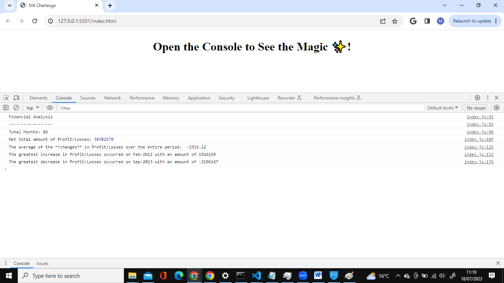

# Console-Finances
creating code for analysing the financial records of a company.

## What I have been given:
I have been given a dataset composed of arrays with two fields: Date and Profit/Losses.

## What are my tasks:
My task is to write JavaScript code that analyzes the records to calculate each of the following:

1. The total number of months included in the dataset.

2. The net total amount of Profit/Losses over the entire period.

3. The average of the changes in Profit/Losses over the entire period.

I will need to track what the total change in profits is from month to month and then find the average.
(Total/(Number of months - 1))

4. The greatest increase in profits (date and amount) over the entire period.

5. The greatest decrease in losses (date and amount) over the entire period.

